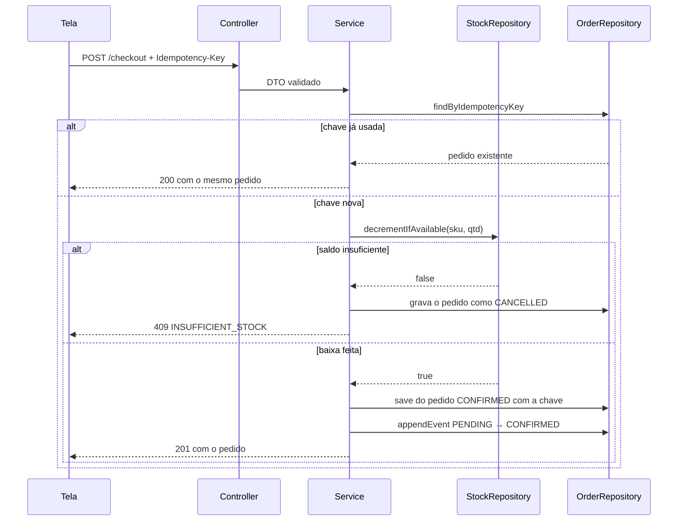

# CellShop

Loja de capinhas com o fluxo de compra fechado de ponta a ponta: uma API que recebe a tentativa de compra, valida, dá baixa no estoque e responde, e uma tela que mostra o andamento, evita o clique duplo e explica sucesso e erro em português.

Desafio técnico CaseCellShop — júnior fullstack. Back-end em NestJS + TypeScript, front-end em React + TypeScript, dados em memória.

---

## Como rodar

**Um comando, sem instalar nada além do Docker:**

```bash
docker compose up --build
```

A loja abre em `http://localhost:8080`. O front é servido por um nginx que também faz o proxy de `/api` para a API, então tudo acontece numa porta só.

**Desenvolvendo, com Node:**

```bash
npm install
npm run dev
```

Sobe a API em `:3333` e a tela em `:5173`, com os logs dos dois no mesmo terminal. `npm test` roda a suíte dos dois pacotes e `npm run lint` passa o eslint nos dois.

Os detalhes de cada lado — variáveis de ambiente, comandos, exemplos de `curl`, roteiro de demonstração — estão nos READMEs de [`back-end/`](./back-end/README.md) e [`front-end/`](./front-end/README.md).

## O fluxo do checkout



## Decisões e trade-offs

### NestJS num fluxo pequeno

O Nest traz mais estrutura do que uma tarefa deste tamanho exige. Em troca, as camadas ficam explícitas, a injeção de dependência troca o repositório em memória por um de banco numa linha, a validação sai dos próprios DTOs e o Swagger é gerado do código.

O que se perdeu: boilerplate. Módulo, provider e decorator para coisas que no Express seriam três linhas soltas. Considero que valeu porque a promessa central do projeto (rocar memória por MySQL sem reescrever o domínio) só é verificável se essa separação existir de verdade.

### Dados em memória, não banco

O enunciado libera dados em memória e cobra "simples de executar". Sem banco, o projeto sobe com um comando e não pede nada instalado.

O que se perdeu: responsabilidades que o banco resolveria sozinho passaram para o código. Não deixar o estoque negativo, garantir que um pedido não seja criado duas vezes, manter o pedido e seus itens consistentes, tudo isso virou código, e por isso virou teste. E o estoque volta ao seed a cada reinício, o que num ambiente de demonstração é até conveniente, mas não é o comportamento de um sistema real.

Os repositórios foram desenhados em cima da modelagem, um para um:

| Repositório | Tabelas de [`database-model.md`](./docs/database-model.md) |
|---|---|
| `InMemoryCatalogRepository` | `products`, `product_variants` |
| `InMemoryStockRepository` | `stock` |
| `InMemoryOrderRepository` | `orders`, `order_items`, `order_recipients`, `order_events` |

Cada método tem uma operação equivalente em SQL. Trocar a implementação é criar as três classes novas e mudar o `useClass` de cada módulo; os serviços e os testes ficam como estão.

### A atomicidade da baixa de estoque

Numa compra concorrente, checar o saldo e depois descontar é uma corrida: duas requisições leem "tem 1" e as duas descontam. `decrementIfAvailable` resolve isso fazendo as duas coisas numa operação síncrona só, sem `await` no meio — como o Node roda um callback por vez, nada se intercala entre a checagem e o desconto. A chave de idempotência é gravada na mesma operação que cria o pedido, pela mesma razão.

O que se perdeu: isso é garantia de processo único. Com duas instâncias da API, cada uma com sua memória, a corrida volta. Num banco a mesma ideia vira `UPDATE stock SET available_qty = available_qty - ? WHERE variant_id = ? AND available_qty >= ?`, que é atômico de verdade e vale para o cluster inteiro. A forma da solução é a mesma; o que muda é quem garante.

O teste `does not yield the event loop between check and decrement` existe justamente para quebrar se alguém colocar um `await` no meio.

### O núcleo da modelagem, não a modelagem inteira

O diagrama tem mais tabelas do que o código usa. As sete que sustentam o checkout foram implementadas; `reservas_estoque` e o catálogo de atributos ficaram de fora.

O que se perdeu: reserva de estoque. Ela faz sentido quando o carrinho e o pagamento são passos separados no tempo e é preciso segurar a unidade nesse intervalo. Aqui o checkout é um passo só — a baixa acontece na mesma requisição que cria o pedido — então a reserva não teria nada para segurar. Se o pagamento entrasse no escopo, ela voltaria.

### Dinheiro em centavos

Todo valor monetário é inteiro, em centavos, com sufixo `Cents` no nome do campo: R$ 79,90 é `7990`. Ponto flutuante acumula erro justo na borda JSON/JavaScript, que é onde esses valores mais circulam.

O que se perdeu: a formatação vira responsabilidade explícita. A API devolve `priceCents` e também `formattedPrice`, para a tela não reinventar a conversão em cada lugar.


### Contrato antes do código

Os DTOs e os controllers decorados vieram primeiro, com o corpo lançando `NotImplementedException`. O contrato ficou navegável no Swagger antes de existir comportamento, e o [`docs/openapi.json`](./docs/openapi.json) é gerado do código — os tipos do front saem desse mesmo arquivo.

O que se perdeu: uma etapa a mais no fluxo. Quando o contrato muda, é preciso regenerar o arquivo e os tipos. Em compensação não existe um YAML paralelo envelhecendo em silêncio, e o hook de `pre-push` recusa um push com o `openapi.json` desatualizado.


### Validação nos dois lados

A API valida tudo que recebe, e a tela valida o que consegue antes de enviar: uma linha que pede mais unidades do que o estoque tem, ou um SKU que saiu do catálogo, bloqueiam o botão de finalizar. É duplicação de propósito — a do cliente dá resposta imediata sem ida ao servidor, a do servidor é a que vale, porque a API é pública e não pode confiar em quem chama.

O que se perdeu: duas listas de regras para manter em sincronia. As mensagens da API vêm num `details` por campo, o que deixa a tela mostrar o erro do servidor no lugar certo em vez de um aviso genérico.

O formulário de entrega ainda não existe. O checkout envia um destinatário fixo, e a validação de CPF, e-mail e CEP vive só no servidor por enquanto. O contrato já está fechado, então o formulário entra no lugar da constante sem mudar a API.

### Imagens fora da API

Nenhum controller devolve bytes de imagem. Os arquivos ficam em `back-end/public/images/`, são servidos como estáticos e a API devolve só a URL, montada a partir de `IMAGES_BASE_URL`.

O que se perdeu: nada relevante neste escopo, e o caminho para produção fica aberto — apontar a variável para um bucket com CDN na frente não muda uma linha do contrato nem do front.

### Duas topologias de execução

Local, o front em `:5173` chama a API em `:3333` e o CORS precisa autorizar essa origem. No Docker, o nginx serve o build e faz proxy de `/api`, então navegador e API compartilham a origem e não há CORS.

Por que não uma só: o Vite embute `VITE_API_URL` no momento do build. Uma imagem com `http://localhost:3333` embutido só funcionaria na máquina de quem a construiu. O que se perdeu é que existem dois caminhos para documentar e manter — e é por isso que essa diferença aparece explicada nos dois READMEs.

### Sem autenticação, sem pagamento, sem usuário

O pedido guarda o destinatário como snapshot, não como referência a uma conta. Não há login nem cobrança.

O que se perdeu: um pedido não tem dono, então não existe "meus pedidos" de verdade, a listagem em `/orders` mostra todos os pedidos da instância. Autenticação e pagamento estão fora do que o enunciado pede.

## Como os testes cobrem os problemas do case

**Estoque sob concorrência.** `sells exactly one unit under ten concurrent requests` e `confirms exactly one of ten concurrent purchases of the last unit` disparam dez compras simultâneas da última unidade e conferem que exatamente uma passa. `does not yield the event loop between check and decrement` protege a invariante que faz isso funcionar, e `never lets available quantity go negative` fecha o cerco pelo resultado.

**Compra duplicada.** `creates a single order for two concurrent calls with the same key` faz duas requisições concorrentes com a mesma chave e verifica que só nasce um pedido. Do lado da tela, `triggers a single request for five rapid clicks` clica cinco vezes seguidas em finalizar e confere que sai uma requisição só, e `sends the same key on a retry after a network failure` garante que uma nova tentativa não vira um pedido novo.

**Mensagens claras.** Os testes do front cobrem cada resultado pela mensagem que ele produz: `names the capinha that ran short when the stock conflicts` para o `409`, `spells out what the api rejected instead of only the generic message` para o `422`, `shows an error message and a working retry button` para a falha de carregamento e `never shows an http status when the purchase fails` para garantir que nenhum código técnico vaze para a tela. A mensagem que o cliente lê é comportamento, não enfeite.

## O que eu faria a seguir

Com mais tempo, na ordem em que atacaria:

**Banco de verdade.** Trocar os três repositórios em memória por implementações MySQL, com a baixa de estoque virando `UPDATE` condicional e a chave de idempotência ganhando índice único. É a mudança que transforma as garantias de processo único em garantias reais.

**Cache e CDN na leitura.** A vitrine é o endpoint mais chamado e o que menos muda. Cache de resposta na API e as imagens atrás de uma CDN tiram a maior parte da carga antes que ela chegue no banco.

**Fila e worker para o que vem depois do pedido.** Confirmação por e-mail, integração com logística, emissão de nota — nada disso precisa acontecer dentro da requisição de checkout. Gravar o evento numa tabela de saída e deixar um worker consumir mantém o checkout rápido e torna essas etapas reprocessáveis quando falham.

**Reserva de estoque.** Necessária no dia em que o pagamento entrar e o checkout deixar de ser um passo só. A tabela já está prevista na modelagem.

## Documentos

| Arquivo | O que tem |
|---|---|
| [`docs/database-model.md`](./docs/database-model.md) | As tabelas do checkout, coluna a coluna, com o DER |
| [`docs/api.md`](./docs/api.md) | O contrato da API em resumo |
| [`docs/decisions.md`](./docs/decisions.md) | As decisões registradas ao longo do desenvolvimento |
| [`docs/openapi.json`](./docs/openapi.json) | O OpenAPI gerado a partir do código |
