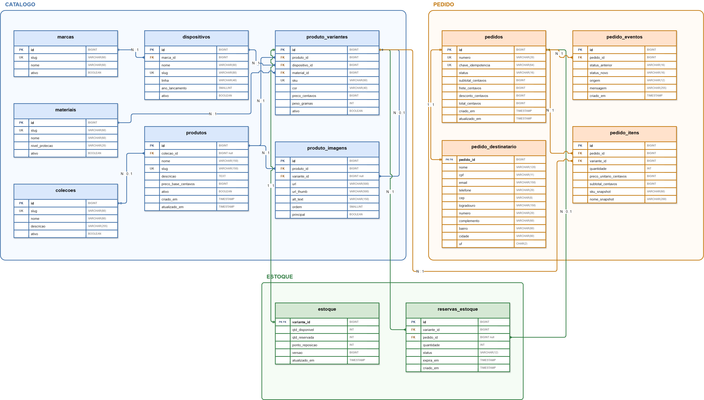

# Modelagem do banco

Usaremos apenas estas 7 tabelas. As outras que aparecem no diagrama não são tão relevantes para validar o
escopo de checkout pedido pela tarefa.

---

## products

| Coluna | Tipo | Chave |
|---|---|---|
| id | BIGINT | PK |
| name | VARCHAR(150) | |
| slug | VARCHAR(150) | UK |
| description | TEXT | |
| base_price_cents | BIGINT | |
| active | BOOLEAN | |
| created_at | TIMESTAMP | |
| updated_at | TIMESTAMP | |

## product_variants

| Coluna | Tipo | Chave |
|---|---|---|
| id | BIGINT | PK |
| product_id | BIGINT | FK → products |
| sku | VARCHAR(60) | UK |
| device | VARCHAR(80) | |
| material | VARCHAR(60) | |
| color | VARCHAR(40) | |
| price_cents | BIGINT | |
| weight_grams | INT | |
| image_url | VARCHAR(500) | |
| thumb_url | VARCHAR(500) | |
| active | BOOLEAN | |

UNIQUE (product_id, device, material, color)

## stock

| Coluna | Tipo | Chave |
|---|---|---|
| variant_id | BIGINT | PK, FK → product_variants |
| available_qty | INT | |
| reserved_qty | INT | |
| version | BIGINT | |
| updated_at | TIMESTAMP | |

CHECK (available_qty >= 0)

## orders

| Coluna | Tipo | Chave |
|---|---|---|
| id | BIGINT | PK |
| number | VARCHAR(20) | UK |
| idempotency_key | VARCHAR(64) | UK |
| status | VARCHAR(16) | |
| subtotal_cents | BIGINT | |
| shipping_cents | BIGINT | |
| discount_cents | BIGINT | |
| total_cents | BIGINT | |
| created_at | TIMESTAMP | |
| updated_at | TIMESTAMP | |

status: PENDING · CONFIRMED · CANCELLED · FAILED

## order_items

| Coluna | Tipo | Chave |
|---|---|---|
| id | BIGINT | PK |
| order_id | BIGINT | FK → orders |
| variant_id | BIGINT | FK → product_variants |
| quantity | INT | |
| unit_price_cents | BIGINT | |
| subtotal_cents | BIGINT | |
| sku_snapshot | VARCHAR(60) | |
| name_snapshot | VARCHAR(200) | |

UNIQUE (order_id, variant_id)

## order_recipients

| Coluna | Tipo | Chave |
|---|---|---|
| order_id | BIGINT | PK, FK → orders |
| name | VARCHAR(120) | |
| tax_id | VARCHAR(11) | |
| email | VARCHAR(150) | |
| phone | VARCHAR(20) | |
| zip_code | VARCHAR(8) | |
| street | VARCHAR(150) | |
| number | VARCHAR(20) | |
| complement | VARCHAR(60) | |
| district | VARCHAR(80) | |
| city | VARCHAR(80) | |
| state | CHAR(2) | |

## order_events

| Coluna | Tipo | Chave |
|---|---|---|
| id | BIGINT | PK |
| order_id | BIGINT | FK → orders |
| previous_status | VARCHAR(16) | |
| new_status | VARCHAR(16) | |
| source | VARCHAR(12) | |
| message | VARCHAR(255) | |
| created_at | TIMESTAMP | |
